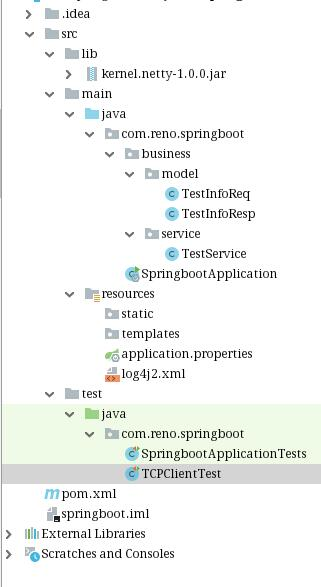

# springboot.netty
**springboot+netty  封装好的netty服务端方法，引用之后，只需编写业务端代码即可**

项目结构如下：




## 1.引用核心包

核心包：kernel.netty-1.0.0.jar

maven中引用

```
<dependency>
            <groupId>com.sun</groupId>
            <artifactId>kernel.netty</artifactId>
            <version>1.0.0</version>
            <scope>system</scope>
            <systemPath>
                ${project.basedir}/src/lib/kernel.netty-1.0.0.jar
            </systemPath>
 </dependency>
```

## 2.编写业务层代码

```
import lombok.Data;

/**
 * @author jhl
 * @title: TestInfoReq
 * @projectName
 * @description: 业务请求类
 * @date 2021-1-19
 */
@Data
public class TestInfoReq {
    private String name;
    private String id;
}
```

```
import lombok.AllArgsConstructor;
import lombok.Data;
import lombok.NoArgsConstructor;

/**
 * @author jhl
 * @title: TestInfoResp
 * @projectName
 * @description: 业务响应类
 * @date 2021-1-19
 */
@Data
@NoArgsConstructor
@AllArgsConstructor
public class TestInfoResp {
    private String message;
    private String reqContent;
}
```

```
import com.alibaba.fastjson.JSON;
import com.reno.springboot.business.model.TestInfoReq;
import com.reno.springboot.business.model.TestInfoResp;
import com.sun.kernel.netty.annotation.NettyBusinessAnnotation;
import com.sun.kernel.netty.common.RequestHeader;
import com.sun.kernel.netty.common.RequestMessage;
import com.sun.kernel.netty.common.ResponseHeader;
import com.sun.kernel.netty.common.ResponseMessage;
import com.sun.kernel.netty.handler.AbstractCommonBusiness;
import org.slf4j.Logger;
import org.slf4j.LoggerFactory;
import org.springframework.stereotype.Component;

/**
 * @author jhl
 * @title: 测试
 * @description: 测试  具体业务操作类  注意：填写注解 beancode不要重复
 * @date 2021-1-19
 */
@Component
@NettyBusinessAnnotation(code = 111, beanCode = "TestService", beanName = "测试")
public class TestService extends AbstractCommonBusiness {

    Logger logger = LoggerFactory.getLogger(TestService.class);

    @Override
    protected ResponseMessage<?> createBusiness(String transCode, RequestMessage<?> msg) {
        RequestHeader reqHeader = msg.getRequestHeader();
        ResponseMessage<TestInfoResp> message = new ResponseMessage<TestInfoResp>();
        ResponseHeader respHeader = getBaseRespHeader(reqHeader);
        message.setResponseHeader(respHeader);
        TestInfoResp respInfo = new TestInfoResp();
        try {
            logger.info("TestService ===== ", msg.getRequestJson());
            RequestMessage<TestInfoReq> response = JSON.parseObject(msg.getRequestJson(), new com.alibaba.fastjson.TypeReference<RequestMessage<TestInfoReq>>() {
            });
            TestInfoReq baseInfoReq = response.getRequestBody();
            respInfo.setMessage("Test000");
            respInfo.setReqContent(baseInfoReq.getId() + "--" + baseInfoReq.getName());
        } catch (Exception ex) {

        }
        message.setResponseBody(respInfo);
        return message;

    }
}

```

## 3.业务测试

```

import com.reno.springboot.business.model.TestInfoReq;;
import com.sun.kernel.netty.client.NettySocketClient;
import com.sun.kernel.netty.common.RequestHeader;
import com.sun.kernel.netty.common.RequestMessage;
import com.sun.kernel.netty.utils.ReqRespUtils;
import org.junit.Test;

public class TCPClientTest {

	@Test
	public final void testService() throws Exception {
		RequestMessage<TestInfoReq> reqMsg = new RequestMessage<TestInfoReq>();
		TestInfoReq reqBody = new TestInfoReq();
		reqBody.setId("000111");
		reqBody.setName("my-test");

		RequestHeader reqHeader = new RequestHeader();
		reqHeader.setTransCode("TestService");

		reqHeader.setBusinessId("B1000666");
		reqHeader.setSrcReqDate("20201111");
		reqHeader.setSrcReqTime("131212");
		reqHeader.setSrcReqId("001");

		reqMsg.setRequestHeader(reqHeader);

		reqMsg.setRequestBody(reqBody);

		String content = ReqRespUtils.requestMessageToJson(reqMsg);

		NettySocketClient client = new NettySocketClient();

		testSend(client,content);


	}

	public void testSend(NettySocketClient client,String content) throws Exception{
		for(int i=0;i<1;i++){
			System.out.println("=================start send===================");
			System.out.println(client.sendAndRecv(content, "GBK", "127.0.0.1", 8888));
			System.out.println("=================end   send===================");
		}
	}


}
```


